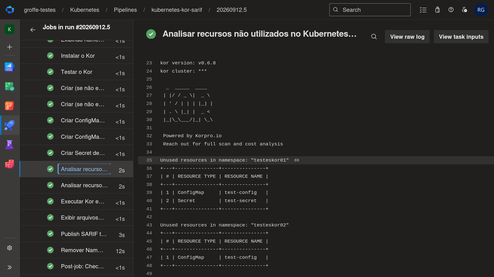

# azuredevops-kubernetes-kor
Exemplo de uso da ferramenta Kor analisando workloads (ConfigMaps, Secrets) em desuso em um cluster Kubernetes.

## Testes

Pipeline executado com a exibição de resultados no formato de uma tabela em modo texto:

Alertas gerados a partir do arquivo SARIF:

